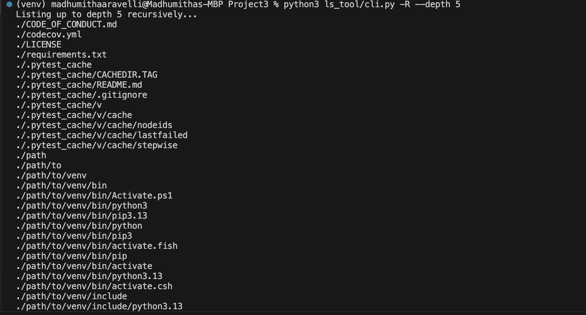
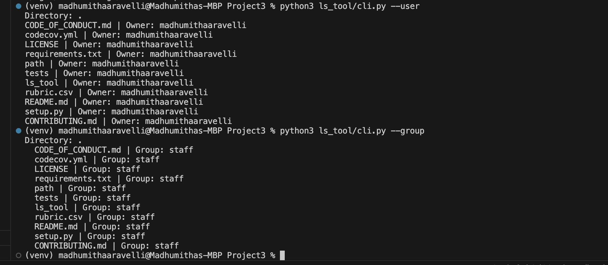
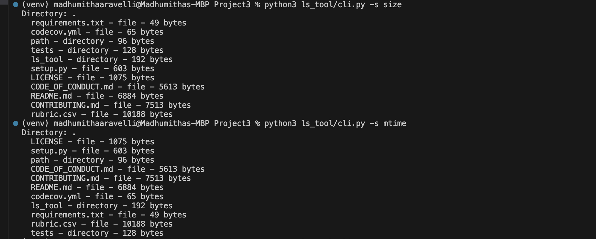
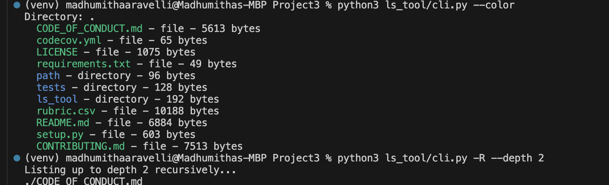
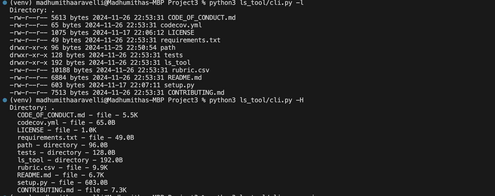

# Project3


[](https://opensource.org/licenses/MIT)
[](https://www.python.org/dev/peps/pep-0008/)
[](https://github.com/madhumithaaravelli/Project3/issues)
[](https://GitHub.com/madhumithaaravelli/Project3/)


[](https://GitHub.com/madhumithaaravelli/Project3/)
[](https://GitHub.com/madhumithaaravelli/Project3/)
[](https://GitHub.com/madhumithaaravelli/Project3/)
[](https://GitHub.com/madhumithaaravelli/Project3/)
[](https://GitHub.com/madhumithaaravelli/Project3/)
[](https://zenodo.org/badge/latestdoi/429097663)
[](https://img.shields.io/github/v/release/madhumithaaravelli/Project3?color=ff69b4&label=Version)
[](https://gitHub.com/madhumithaaravelli/Project3)
[](https://codecov.io/gh/madhumithaaravelli/Project3)
[](https://github.com/madhumithaaravelli/Project3/actions/workflows/main.yml)

# Python LS Tool

This is a Python-based tool that replicates the core functionality of the Unix `ls` command. It supports multiple flags for listing files and directories with various options.
This project is designed to provide similar functionality with additional custom features. It showcases the ability to handle various flags, recursively list directory contents, and process file metadata in a user-friendly way. The project is implemented using Python's standard libraries and organized in a modular structure.

## Demo link 

https://drive.google.com/file/d/1_ITYOcTvk_5eOt2xWI_2pGiFR8xBRh3Z/view?usp=sharing

## Features

- List files in the current directory
  
-a, --all	Include hidden files.

-R, --recursive	List directories recursively.

-j, --json	Output the result in JSON format.

-s, --sort {size,mtime}	Sort files by size or modification time.

-p, --python	List only Python files (*.py).

-t, --tests	List test files in the tests/ folder.

-e, --env	List virtual environments in the specified directory.

-d, --dependencies	List dependency files such as requirements.txt, Pipfile, or Pipfile.lock.

-P, --permissions Display permissions of a file

-c, --checksum Display file checksum (currently used md5 algorithm to compute checksum)

-l, --long Use a long listing format to display permissions , modification date & time, size 

-H, --human Display size of a file in human readable format

--reverse, Reverse the sorting order

-F, --classify  Append file type indicators

--color  Colorize output based on file type

--depth DEPTH  Limit recursion depth (e.g., --depth 2)

--exclude EXCLUDE Exclude files matching a pattern (e.g., '*.tmp')

--user Display the owning user of each file

--group Display the owning group of each file

The custom ls tool supports the following functionality:

### Core Features:

  **Directory Listing:** Lists files and directories in the specified path.
  
  **Hidden Files:** Includes hidden files with the -a flag.
    
  **Recursive Listing:** Recursively lists directory contents with the -R flag.
    <p align="center"></p>

    
  **JSON Output:** Outputs results in JSON format with the -j flag.

  **User and group details:** Outputs the files along with owner and group 
  <p align="center"></p>


### Custom Features:

  **Sorting:**
  
      By file size (-s size).
        
      By modification time (-s mtime).

      reverse the sorting order

  <p align="center"></p>

        
  **File Type Filters:**
  
      Python files (-p).
        
      Test files in the tests/ folder (-t).
        
  **Environment Detection:** Lists virtual environments (-e).
  
  **Dependencies:** Lists common dependency files like requirements.txt and Pipfile (-d).

  **Colorize:** Outputs the list of files and directories with different colors based on file type.
  <p align="center"></p>

  **Checksum:** Outputs the list of files along with unique hexa decimal text called checksum.

  **Long and Human readable file size outputs:** Displays the output in long format and other flag converts size to human readable size.
  <p align="center"></p>

    
## Installation

### Prerequisites:

    Python 3.7 or higher.

1. **Install Python:**
   - Ensure you have at least Python3 installed on your system.

2. **Clone Repository:**
   - Clone this repository to a directory of your choice on your local system.

3. **Navigate and Install Dependencies:**
   - Open a terminal session, navigate to the cloned repository, and run:
     ```bash
     cd python-ls-tool
     pip install -r requirements.txt
     ```

4. **Run the Script:**
   - In the terminal, export the PYTHONPATH variable to the main project folder:
     ```bash
     python3 ls_tool/cli.py [OPTIONS] [PATH]
     ```
     
## Example commands

List all files in the current directory:

 - ```python3 ls_tool/cli.py```

List all files, including hidden ones:

 - ```python3 ls_tool/cli.py -a```

List directory contents recursively:

 - ```python3 ls_tool/cli.py -R```

List only Python files:

 - ```python3 ls_tool/cli.py -p```

List test files in the tests/ folder:

 - ```python3 ls_tool/cli.py -t```

Sort files by size in the current directory:

 - ```python3 ls_tool/cli.py -s size```

Output the result in JSON format:

 - ```python3 ls_tool/cli.py -j```

Output the recursive list of all file with depth 2

 - ```python3 ls_tool/cli.py -R --depth 2```

Colorize output based on file type

 - ```python3 ls_tool/cli.py --color```

Exclude list of .txt files from output

 - ```python3 ls_tool/cli.py --exclude *.txt```


## Testing

To test the functionality of the tool, use pytest:

 - ```pytest tests/```

   
:page_facing_up: License
---
This project is licensed under the terms of the MIT license. Please check [LICENSE](https://github.com/madhumithaaravelli/Project3/blob/main/LICENSE) for more details.

## Contributors
<table>
  <tr>
    <td align="center"><br /><sub><b>Madhumitha Aravelli</sub></a><br /></td>
  </tr>
</table>

# :calling: Support

For any support, email us at `maravel@ncsu.edu`

